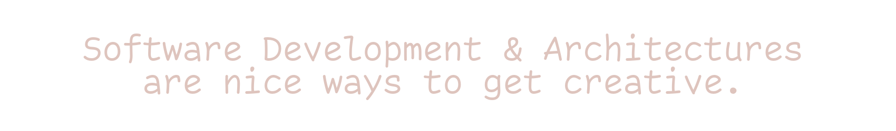

#### Hello world! 🙋‍♂️ This is mainly my software development experiences (dxps) space.

 
A summary about myself, while wearing solution architect and developer hats:
  

- Nowadays, thinking in (and kinda obsessed with) Rust programming language.
- Still liking Golang, and Distributed Systems as a generic architecture.
- Big fan of Clean Architecture and Event Driven Architectures.
- Used to love Java and (most of) its ecosystem. Not anymore.

I had very satisfying results implementing middleware and high available clustering solutions and delivering trainings on IBM products and its great AIX operating system. For further details, checkout my [Linkedin profile](https://www.linkedin.com/in/marius-ileana/).

 

|       |      |
| ----: | :--- |
|   |  |

<!--
**dxps/dxps** is a ✨ _special_ ✨ repository because its `README.md` (this file) appears on your GitHub profile.

Here are some ideas to get you started:

- 🔭 I’m currently working on ...
- 🌱 I’m currently learning ...
- 👯 I’m looking to collaborate on ...
- 🤔 I’m looking for help with ...
- 💬 Ask me about ...
- 📫 How to reach me: ...
- 😄 Pronouns: ...
- ⚡ Fun fact: ...
-->
