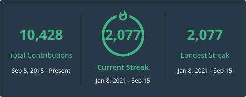

A summary about myself, while wearing solution architect and developer hats:
 

- Big fan of Clean and Event Driven Architectures.
- Currently, very excited coding using Zig.
- An enthusiast Rust developer.
- Loving Golang, and Distributed Systems.
- Used to love Java and (most of) its ecosystem. Not anymore.

I had very satisfying results implementing middleware and highly available clustering solutions, and delivering trainings on some of the IBM products, including its great AIX (UNIX based) operating system. More details can be found on [my Linkedin profile](https://www.linkedin.com/in/marius-ileana/).

 

|                                                                                                      |                                                                                                   |
| ---------------------------------------------------------------------------------------------------: | :------------------------------------------------------------------------------------------------ |
|  |  |

<!--
**dxps/dxps** is a ✨ _special_ ✨ repository because its `README.md` (this file) appears on your GitHub profile.

Here are some ideas to get you started:

- 🔭 I’m currently working on ...
- 🌱 I’m currently learning ...
- 👯 I’m looking to collaborate on ...
- 🤔 I’m looking for help with ...
- 💬 Ask me about ...
- 📫 How to reach me: ...
- 😄 Pronouns: ...
- ⚡ Fun fact: ...
-->
